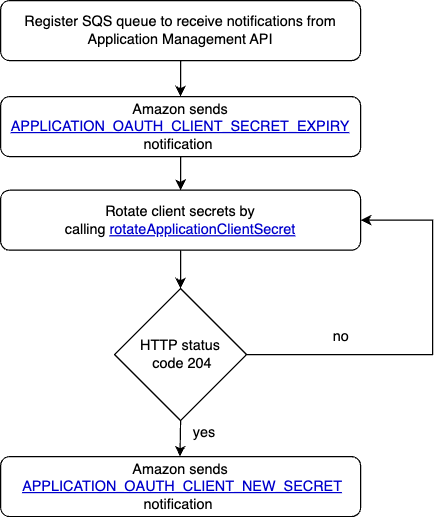

## Application Management API
The Selling Partner API for Application Management lets you programmatically rotate the LWA client secrets on your registered applications.

If you haven't already, we recommend you to navigate the following resources:
* [Application Management API Use Case Guide](https://developer-docs.amazon.com/sp-api/docs/application-management-api-v2023-11-30-use-case-guide)
* [Application Management API reference](https://developer-docs.amazon.com/sp-api/docs/application-management-api-v2023-11-30-reference)

## Solution
This Sample Solution implements a Login with Amazon (LWA) credential rotation workflow that reacts to incoming [APPLICATION_OAUTH_CLIENT_SECRET_EXPIRY](https://developer-docs.amazon.com/sp-api/docs/application-management-api-v2023-11-30-use-case-guide#step-2-register-your-sqs-queue-to-receive-expiring-credential-notifications) notification and checks if the rotation is within the set threshold and will rotate the credentials and save the newly received secrets via [APPLICATION_OAUTH_CLIENT_NEW_SECRET](https://developer-docs.amazon.com/sp-api/docs/application-management-api-v2023-11-30-use-case-guide#step-3-get-the-latest-client-secret-from-your-sqs-queue).
If you want to test the proposed solution, do changes and/or integrate it to your own product, follow the steps under [Deployment Guide](docs/DEPLOYMENT.md).

## Workflow
The LWA rotation workflow starts by receiving [APPLICATION_OAUTH_CLIENT_SECRET_EXPIRY](https://developer-docs.amazon.com/sp-api/docs/application-management-api-v2023-11-30-use-case-guide#step-2-register-your-sqs-queue-to-receive-expiring-credential-notifications) notification in your SQS queue. Next step is to call the Application Management API to rotate the client secret. Finally, the new secret is sent as [APPLICATION_OAUTH_CLIENT_NEW_SECRET](https://developer-docs.amazon.com/sp-api/docs/application-management-api-v2023-11-30-use-case-guide#step-3-get-the-latest-client-secret-from-your-sqs-queue) notification to your SQS queue.



## Sample Code
Below you can find sample code for the most relevant LWA Rotation operations:
* [Rotate secret](#rotate-secret)
* [Get new secret](#get-new-secret)

### Rotate secret
How to handle secret expiry notification and secret rotation

#### Java
*Find the full code [here](https://github.com/amzn/selling-partner-api-samples/blob/main/use-cases/lwa-rotation/code/java/src/main/java/lambda/RotateSecretsHandler.java)*
```java
public String handleRequest(SQSEvent event, Context context) {
    for (SQSEvent.SQSMessage message : event.getRecords()) {
        // Parse the notification payload
        NotificationPayload notificationPayload = mapNotification(message.getBody());

        // Validate the notification type
        if (!"APPLICATION_OAUTH_CLIENT_SECRET_EXPIRY".equals(notificationPayload.getNotificationType())) {
            continue;
        }

        // Validate the clientId
        String clientId = notificationPayload.getPayload().getApplicationOAuthClientSecretExpiry().getClientId();
        if (!clientId.equals(storedClientId)) {
            continue;
        }

        // Check if the client secret is expiring within the threshold
        final int expiryThresholdDays = 7;
        ZonedDateTime clientSecretExpiryTime = notificationPayload.getPayload().getApplicationOAuthClientSecretExpiry().getClientSecretExpiryTime().atZoneSameInstant(ZoneId.of("UTC"));
        ZonedDateTime currentTime = ZonedDateTime.now(ZoneId.of("UTC"));
        long daysBetween = ChronoUnit.DAYS.between(currentTime, clientSecretExpiryTime);
        if (daysBetween > expiryThresholdDays) {
            continue;
        }

        // Rotate the application client secret
        ApplicationsApi applicationsApi = ApiUtils.getApplicationsApi(regionCode, true);
        applicationsApi.rotateApplicationClientSecretCall(null, null);
    }
}
```

#### Step-by-step:
1. **Iterate through messages:** Iterate through all received messages and filter for client secret expiry notification type.
2. **Validate client id:** Make sure that the client id specified in the notification equals your client id.
3. **Check expiry time:** Make sure that the client secret is expiring within the threshold.
4. **Set up the API client:** Initialize the Applications API client by providing the region code and set boolean to true for grantless operation.
5. **Call the rotateApplicationClientSecretCall operation:** Call the [rotateApplicationClientSecret](https://developer-docs.amazon.com/sp-api/docs/application-management-api-v2023-11-30-reference#rotateapplicationclientsecret) operation and set both progress listeners to null.

### Get new secret
How to handle new client secret notification and secret update

#### Java
*Find the full code [here](https://github.com/amzn/selling-partner-api-samples/blob/main/use-cases/lwa-rotation/code/java/src/main/java/lambda/UpdateSecretsHandler.java)*
```java
public String handleRequest(SQSEvent event, Context context) {
    for (SQSEvent.SQSMessage message : event.getRecords()) {
        // Parse the notification payload
        NotificationPayload notificationPayload = mapNotification(message.getBody());

        // Validate the notification type
        if (!"APPLICATION_OAUTH_CLIENT_NEW_SECRET".equals(notificationPayload.getNotificationType())) {
            continue;
        }

        // Validate the clientId
        String clientId = notificationPayload.getPayload().getApplicationOAuthClientNewSecret().getClientId();
        if (!clientId.equals(storedClientId)) {
            continue;
        }

        // Update the new client secret in Secrets Manager
        // Update this section to align with your secret storage logic
        String newClientSecret = notificationPayload.getPayload().getApplicationOAuthClientNewSecret().getNewClientSecret();
        String secretArn = System.getenv(SP_API_APP_CREDENTIALS_SECRET_ARN_ENV_VARIABLE);
        SecretsManagerClient client = SecretsManagerClient.builder().build();
        PutSecretValueRequest request = PutSecretValueRequest.builder()
                .secretId(secretArn)
                .secretString(String.format("{\"AppClientId\":\"%s\",\"AppClientSecret\":\"%s\"}", clientId, newClientSecret))
                .build();
        client.putSecretValue(request);
    }
}
```

#### Step-by-step:
1. **Iterate through messages:** Iterate through all received messages and filter for new client secret notification type.
2. **Validate client id:** Make sure that the client id specified in the notification equals your client id.
3. **Update the LWA client secret in the AWS Secrets Manager:** Retrieve the new client secret from the notification payload and update the corresponding secret in your secret storage service.